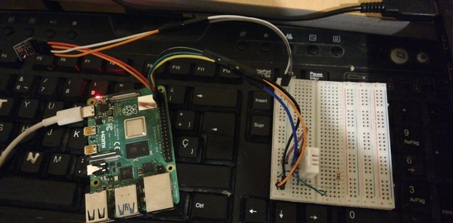
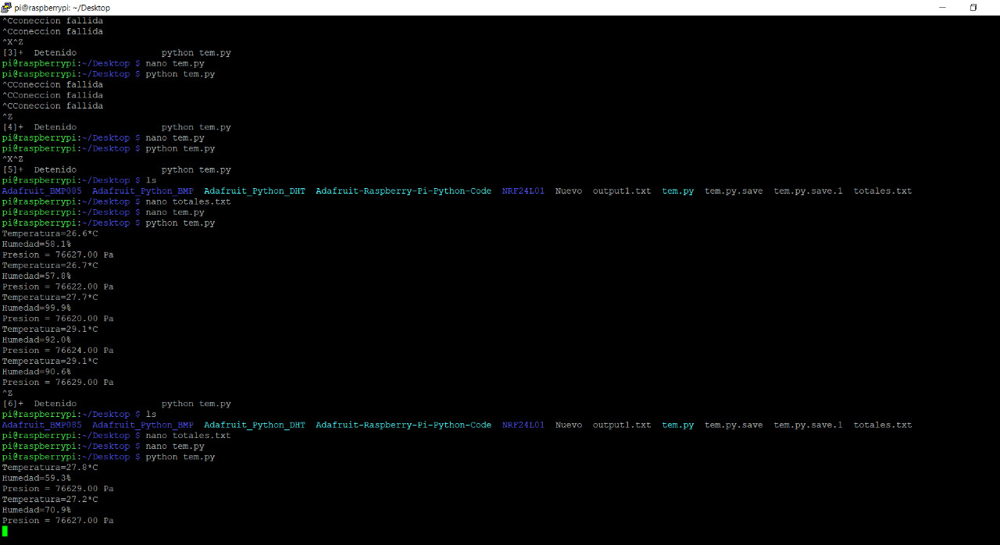
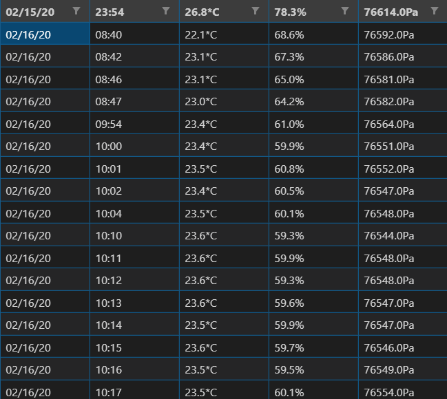
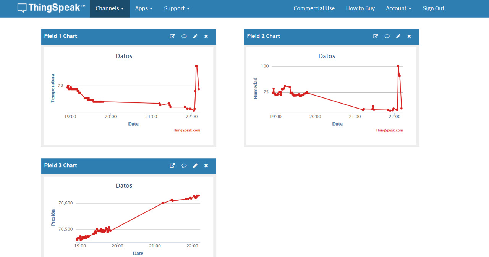

[![Contributors][contributors-shield]][contributors-url]
[![Forks][forks-shield]][forks-url]
[![Stargazers][stars-shield]][stars-url]
[![Issues][issues-shield]][issues-url]
[![MIT License][license-shield]][license-url]
[![LinkedIn][linkedin-shield]][linkedin-url]

<!-- PROJECT LOGO -->

<br />
<p align="center">
  <a href="https://github.com/DarioCabas/ROS_Webpage">
    
</p>

# IOT TEMPERATURE, PRESSURE AND HUMIDITY 

_This is a short description about the content of my project. In this project I read three sensors one of temperature, another of humidity and finally one of pressure. We can talk about this sensors in the next lines. So this values of variables measured are send to the cloud, and we can see this data in the cloud of thingspeak that provide MATLAB for IOT Analytics, you can see all the information in the server and read that information if we need it. In another hand we can write this values also in a CSV file that we can save in a SDcard_

## Getting Started🚀


_These instructions will get you a copy of the project up and running on your local machine for development and testing purposes. See_ **_Deployment_** _for notes on how to deploy the project ._


## Prerequisites:clipboard:

_The hardware that you need is:_ 

```
  Raspberry Pi
```
<p align="center">
    

</p>

```
  Barometric Pressure Sensor BMP085
```
<p align="center">
    

</p>

```
Temperature and humidity sensor - DHT22
```
<p align="center">
    

</p>

_The software that you need is:_ 

```
  -Raspbian
```
```
  -Libraries for use the BMP085 and DHT22
```
```
  -ThingSpeak
```

### Installing🔧

#### Clone

- _Clone this repo to your local machine using_ `https://github.com/DarioCabas/IOT_RASPBERRY`

- _If you need more information about how install raspbian in the raspberry, follow the next link:_
<p align="center">
    <a href="https://projects.raspberrypi.org/en/projects/raspberry-pi-getting-started/1">Raspbian</a>
</p>

#### Enabled I2C 

- _In the raspberry you need enable the I2C communication to use the BMP085 sensor that use this protocol, you can do the next steps:_
- _In the command window you put the next command line:_

```
  sudo raspi-config
```
 _You can see the next window:_
 
 <p align="center">
    
</p>

_Select the line in red and you can see the I2C option that you need enabled:_

 <p align="center">
    
</p>

_Enter in Yes_
 <p align="center">
    
</p>

_Enter in OK_
 <p align="center">
    
</p>

_And Finally you reboot the system:_
 <p align="center">
    
</p>

## Running the tests ⚙️

**Sensors connected to the raspberry**
 <p align="center">
    
</p>


**Running prom.py**
 <p align="center">
    
</p>

**CSV file with the data**
 <p align="center">
    
</p>


**ThingSpeak**
 <p align="center">
    
</p>


## Deployment📦

_For the crontan that we use to run the envio.py file, you can access to this with the following line:_


```
  crontab -e
```

_And in this project I use in the linux environment the next line for run the envio.py in the crontab_

```
  */5 * * * * cd Desktop && /usr/bin/python envio.py
```


## Built With🛠️

* [Python](https://www.python.org/) - Language
* [Raspberry Pi](https://www.raspberrypi.org/) - Credit-card sized computer
* [ThingSpeak](https://thingspeak.com/) - Data collection in the cloud


## Authors✒️

* **Dario Cabascango** - *Initial work* - [IOT_RASPBERRY](https://github.com/DarioCabas)


## License📄

[](http://badges.mit-license.org)

- **[MIT license](http://opensource.org/licenses/mit-license.php)**


## Contact:e-mail: 

#### Feel free to contact me!

_Dario Cabascango_  - _hz-hertzio@hotmail.com_ 

_Project Link:_ _[https://github.com/DarioCabas/IOT_RASPBERRY](https://github.com/DarioCabas/IOT_RASPBERRY)_


<!-- MARKDOWN LINKS & IMAGES -->
<!-- https://www.markdownguide.org/basic-syntax/#reference-style-links -->
[contributors-shield]: https://img.shields.io/github/contributors/DarioCabas/IOT_RASPBERRY.svg?style=flat-square
[contributors-url]: https://github.com/DarioCabas/IOT_RASPBERRY/graphs/contributors
[forks-shield]: https://img.shields.io/github/forks/DarioCabas/IOT_RASPBERRY.svg?style=flat-square
[forks-url]: https://github.com/DarioCabas/IOT_RASPBERRY/network/members
[stars-shield]: https://img.shields.io/github/stars/DarioCabas/IOT_RASPBERRY.svg?style=flat-square
[stars-url]: https://github.com/DarioCabas/IOT_RASPBERRY/stargazers
[issues-shield]: https://img.shields.io/github/issues/DarioCabas/IOT_RASPBERRY.svg?style=flat-square
[issues-url]: https://github.com/DarioCabas/IOT_RASPBERRY/issues
[license-shield]: https://img.shields.io/github/license/DarioCabas/IOT_RASPBERRY.svg?style=flat-square
[license-url]: https://github.com/DarioCabas/IOT_RASPBERRY/blob/master/LICENSE.txt
[linkedin-shield]: https://img.shields.io/badge/-LinkedIn-black.svg?style=flat-square&logo=linkedin&colorB=555
[linkedin-url]: https://linkedin.com/in/dario-cabascango-9724431a3


